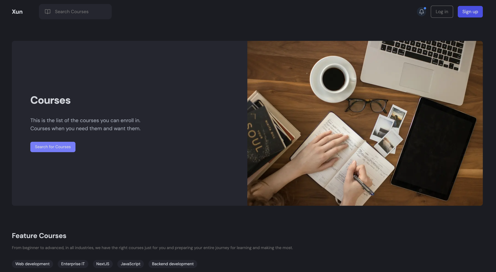
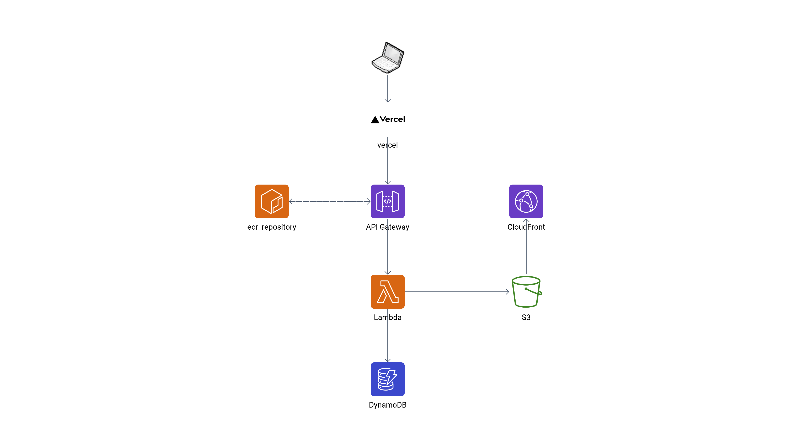
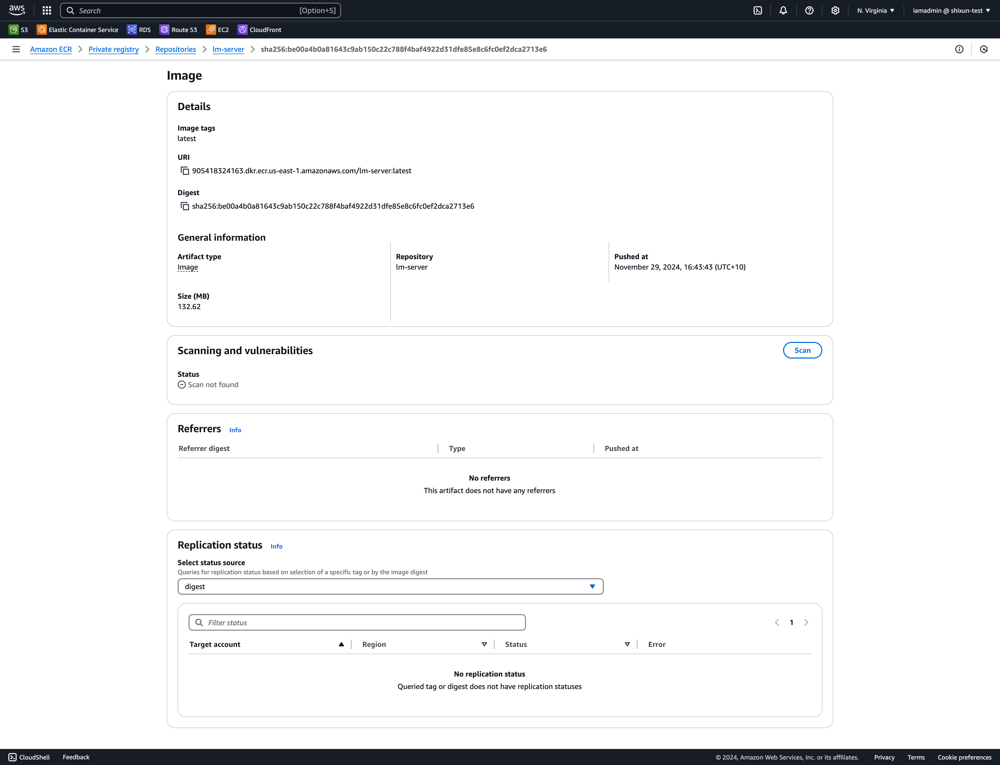
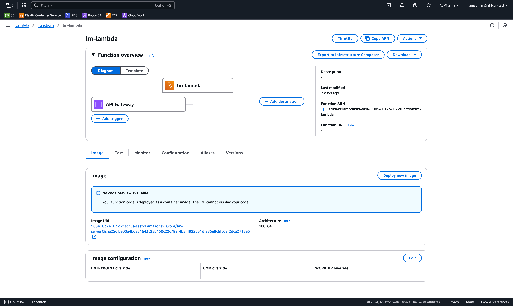
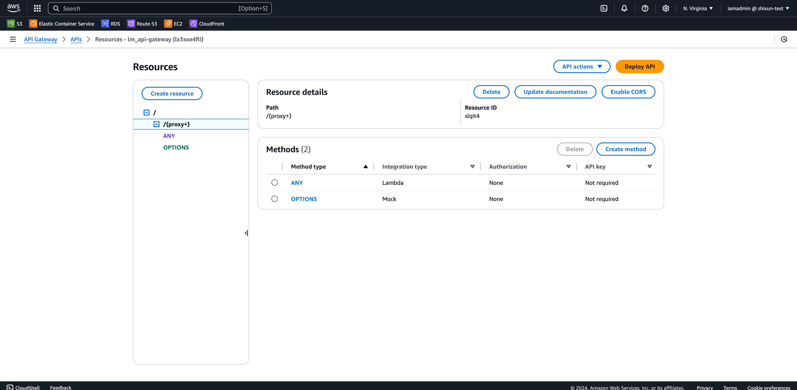

<div align="center">
  <h1>
    Learning Management
  </h1>
  
  <h3>
    <a href="https://lm-prod.top">Visit it Now!</a>
	</h3>
</div>


## About the Project

This is a learning management system similar to Udemy, where users can buy and sell courses on the platform. Built using Next.js and Express, with a DynamoDB database, it is deployed on AWS Lambda for serverless functionality and Vercel. The system also integrates third-party APIs, including Clerk for authentication and Stripe for payment processing.


### 👾 Tech Stack

<details>
  <summary>Frontend</summary>
  <ul style="font-size:14px">
    <li>Next.js</li>
    <li>Tailwind css</li>
    <li>Shadcn</li>
    <li>Clerk</li>
    <li>Stripe</li>
    <li>Redux</li>
  </ul>
</details>

<details>
  <summary>Backend</summary>
  <ul style="font-size:14px">
    <li>Express</li>
    <li>Dynamoose</li>
  </ul>
</details>

<details>
  <summary>AWS</summary>
  <ul style="font-size:14px">
    <li>ECR</li>
    <li>Lambda</li>
    <li>DynamoDB</li>
    <li>S3</li>
    <li>CloudFront</li>
  </ul>
</details>


## 🗺️ Architecture




## Getting Start

### Prepare Enviornment Variables

Create a [Clerk](https://clerk.com/) and [Stripe](https://stripe.com/au?utm_campaign=APAC_AU_EN_Search_Brand_Core_EXA-PHR-21949502811&utm_medium=cpc&utm_source=google&ad_content=699300880290&utm_term=stripe&utm_matchtype=e&utm_adposition=&utm_device=c&gad_source=1&gclid=Cj0KCQiAr7C6BhDRARIsAOUKifgEmdGeDIgNZ8D-TKA8SCHHGuyU91UQt-Ioj1bYshhjMO3jTvZz1ekaApR4EALw_wcB) account first, and obtain the private and public keys for each API.

You should use the corresponding variable names below:

```bash
# client
NEXT_PUBLIC_API_BASE_URL=...
NEXT_PUBLIC_STRIPE_PUBLISHABLE_KEY=...
NEXT_PUBLIC_CLERK_PUBLISHABLE_KEY=...
CLERK_SECRET_KEY=...

# server
NODE_ENV=production
S3_BUCKET_NAME=... # fill after AWS deployment
CLOUDFRONT_DOMAIN=... # fill after AWS deployment
STRIPE_SECRET_KEY=...
CLERK_PUBLISHABLE_KEY=...
CLERK_SECRET_KEY=...
```


### Deploy on AWS

"Terraform code is implementing..."


**DynamoDB intergration**

Create DynamoDB tables by simply run a test event `{"action": "seed"}`, and tables will be automatically deployed in your DynamoDB.


## Screenshots









